# Embark is Awesome!

Hi, I'm [Andrej](https://www.linkedin.com/in/andrejrakic/) and I will show why Embark is my favorite framework in Dapp development so far.

According to [official documentation:](https://embark.status.im/docs/overview.html)

> Embark is a platform that enables easy development and deployment of decentralized applications.

## Installation

In order to make Embark work on our computer, we need to have some tools installed first.

### Node

Please install [Node.js](http://nodejs.org/) in version 8.11.3 LTS or higher.

Version check:

```
npm --version
```

### IPFS (Optional)

IPFS is decentralized storage and it is used in blockchain development because Ethereum blockchain is made for recording transactions, not storing data. Checkout IPFS' [installation guide](https://docs.ipfs.io/introduction/install/) to learn how to install IPFS on our local machine.

Version check:

```
ipfs --version
```

### Ethereum Node (Optional)

Embark can spin up an Ethereum node for us. My recommendation for running a real node is [geth](https://geth.ethereum.org/). Check out the [installation guide](https://ethereum.github.io/go-ethereum/install/) for your platform. Embark already comes with [Ganache CLI](https://truffleframework.com/ganache), a blockchain node emulator, which is accessible via [Embark's simulator](https://embark.status.im/docs/embark_commands.html#simulator) command.

Version check:

```
geth version
```

### Embark

Installation command:

```
npm -g install embark
```

Version check:

```
embark --version
```

## Creating Embark Apps

### Creating a new app

```
embark new <DappName>
```

New React.js app with blockchain tools will be created.

### Creating apps from templates

If you prefer working with typescript run this command:

```
embark new <DappName> --template typescript
```

If you are more comfortable working with Vue.js run this command:

```
embark new <DappName> --template embark-framework/embark-vue-template
```

If you prefer [Vyper](https://vyper.readthedocs.io/en/v0.1.0-beta.13/) over [Solidity](https://solidity.readthedocs.io/en/v0.5.12/) in Smart Contract development use this command:

```
embark new <DappName> --template embark-framework/embark-vyper-template
```

And so on… By far you already can see how embark is powerful. Here is the list of [all templates](https://embark.status.im/templates/) at the moment.

### Creating "contracts-only" apps

The following command will create a project with all Embark services disabled except the blockchain service.

```
embark new <DappName> --contracts-only
```

One doesn't have to manually migrate smart contract to Ethereum blockchain like when one works with [Truffle](https://www.trufflesuite.com/truffle). Embark does that work for us "on save".

## Running Apps

```
embark run
```

By default, this will make Embark do a couple of things:

- It initializes Embark
- It starts the dashboard
- It loads plugins
- It spins up a blockchain and IPFS client, a web server and other necessary services
- It compiles and deploys your app
- It monitors running processes and recompiles and redeploys your app if needed
- It starts Cockpit

You will see **CLI Dashboard** and **web app on localhost:8000.**


This app contains 4 tabs for 4 different services that Embark provides:

- Interacting with smart contracts on Ethereum blockchain
- Decentralized Storage via [IPFS](https://ipfs.io) or [Swarm](https://swarm.ethereum.org)
- P2P Message Communication via [Whisper](https://github.com/ethereum/wiki/wiki/Whisper)
- Naming via [Ethereum Name Service](https://ens.domains)

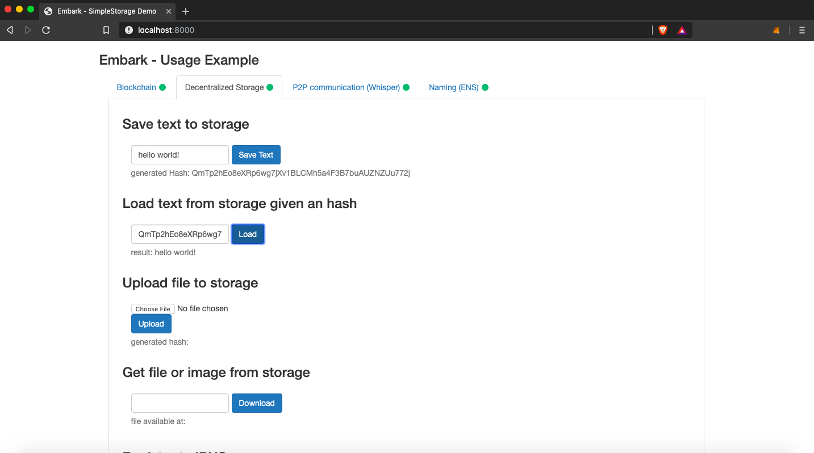

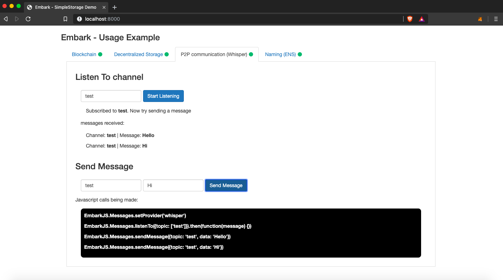


Embark spins up the dashboard view automatically for us, whenever we run `embark run` inside an Embark project. Here's what it looks like:

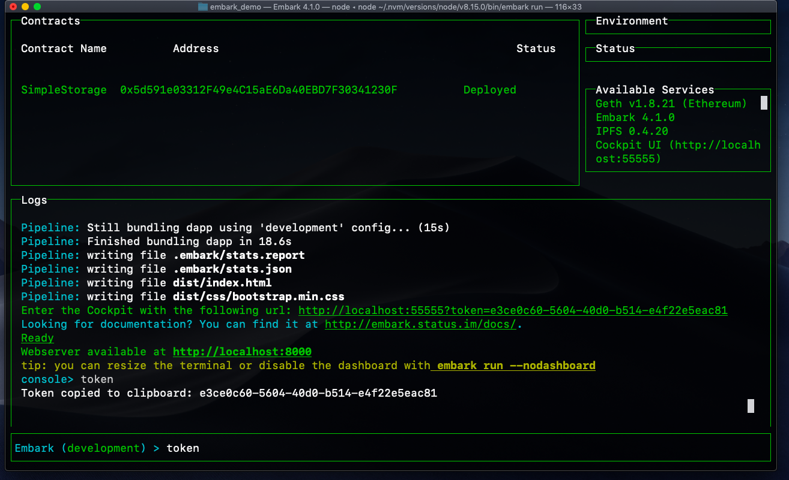

When you type `token` command into CLI Dashboard it will generate token for **Cockpit on localhost:55555**.


Cockpit looks like this:

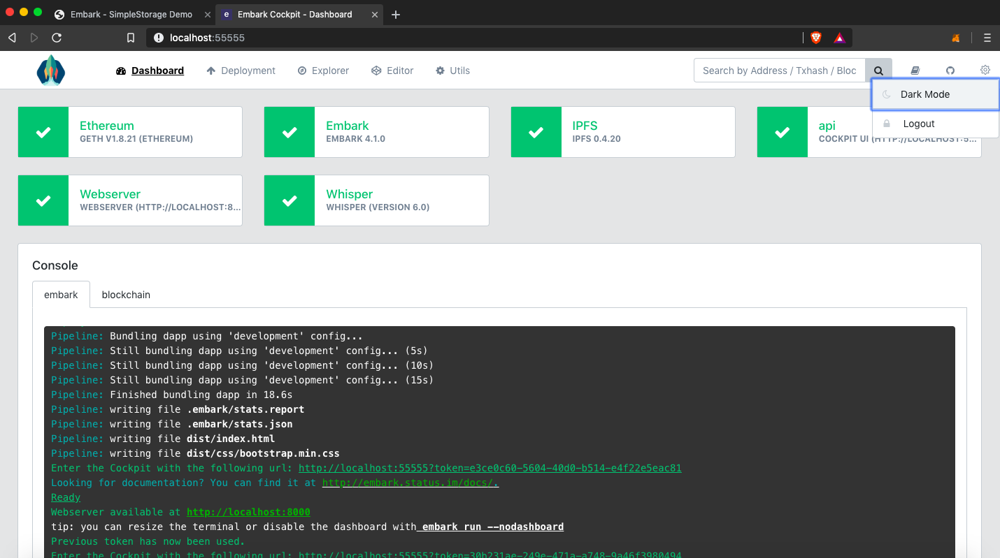

On Dashboard tab one can see all services available and output of CLI Dashboard or Embark's Blockchain simulator (which is actually Ganache CLI). Cockpit comes with **Dark Mode** also.

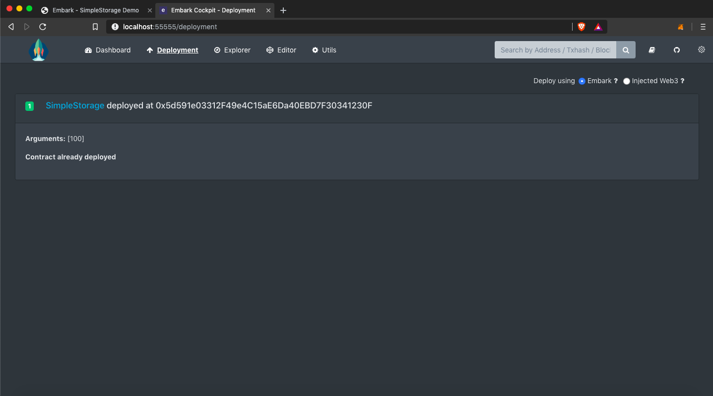

Under Deployment tab one can see all smart contracts currently deployed to blockchain.

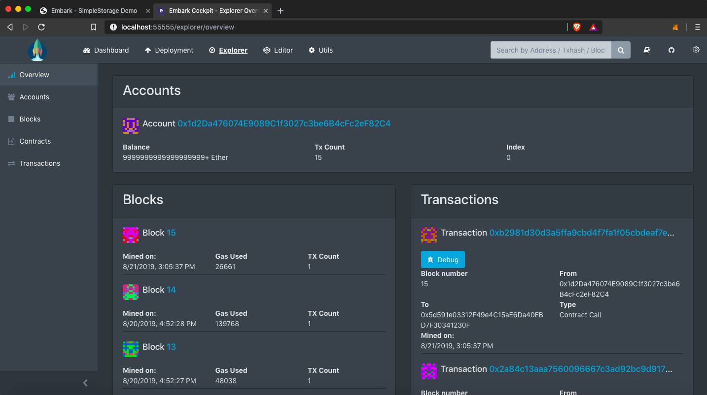

Under Explorer tab one can see all info about Accounts on blockchain net one use (local geth node, some testnet like Ropsten, Rinkeby, etc. or Ethereum Main Net), Blocks mined, Transaction recorded, Contracts deployed, etc. This Explorer tab is like [Etherscan](https://etherscan.io).

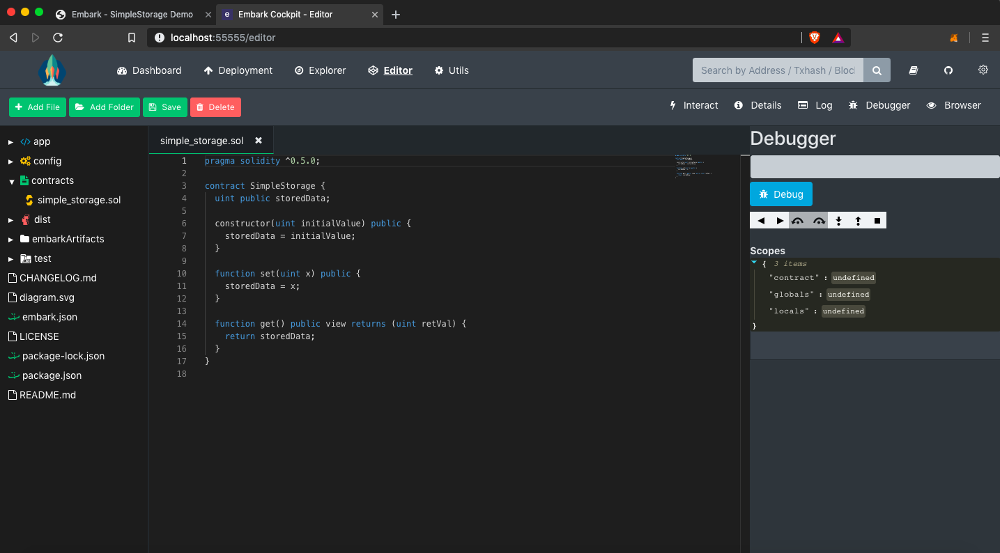

Under editor tab one can see IDE for contract creation with Interact console and Debugger. It is similar to [Remix IDE](http://remix.ethereum.org/#optimize=false&evmVersion=null&version=soljson-v0.5.11+commit.c082d0b4.js) or [Chain IDE](https://eth.chainide.com). My recommendation for development however is Remix IDE because it is the most powerful at the moment and has the best features and additional plugins, in my opinion.


Under Utils tab one can see various useful utilities like ETH Converter, P2P Messaging, Ethereum Name Service, Digitally Sign Transactions, and Transaction Decoder.

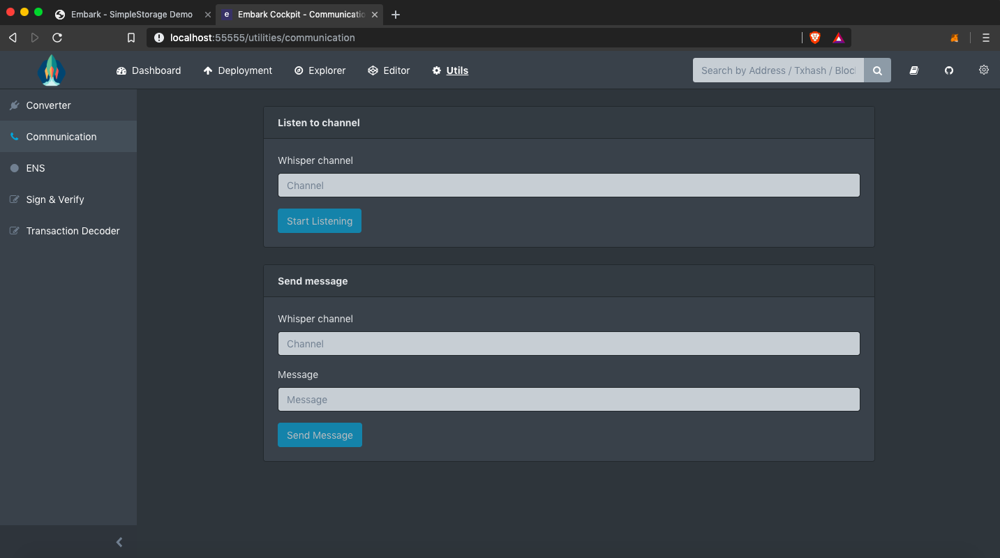

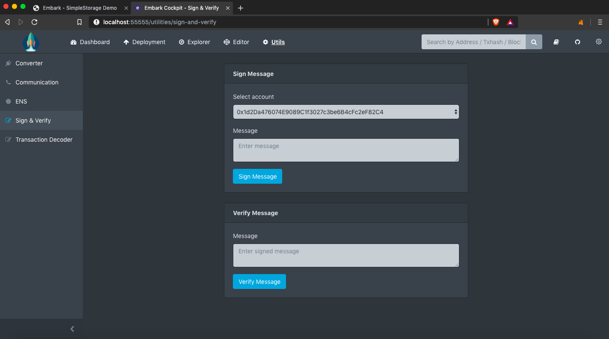


### Running an app without the dashboard

If we don't need the dashboard, we can prevent Embark from starting it by using

```
embark run --nodashboard
```

### Starting a blockchain separately

Sometimes we want to spin blockchain node first before running app itself.

```
embark blockchain
```

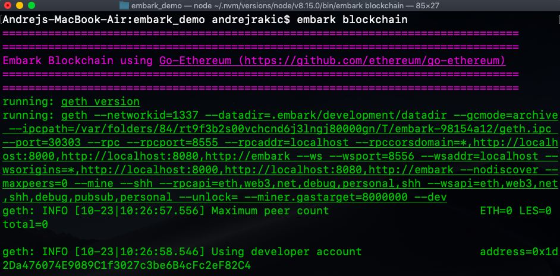

### Using the blockchain simulator

Another feature of Embark is to start a simulated blockchain. This can be useful for testing purposes as there's no need to wait for transactions to be mined. You might have heard of [Ganache CLI](https://truffleframework.com/docs/ganache/quickstart), which is a great project that implements such a simulated blockchain.

```
embark simulator
```


## Testing Smart Contracts

Embark comes with specific testing APIs. Any JavaScript file within test/is considered a spec file and will be executed by Embark as such. Embark uses [Mocha testing framework](https://mochajs.org/) as a test runner behind the scenes.

### Running tests

Once we've written our tests, we can execute them using Embark's `test` command:

```
embark test
```

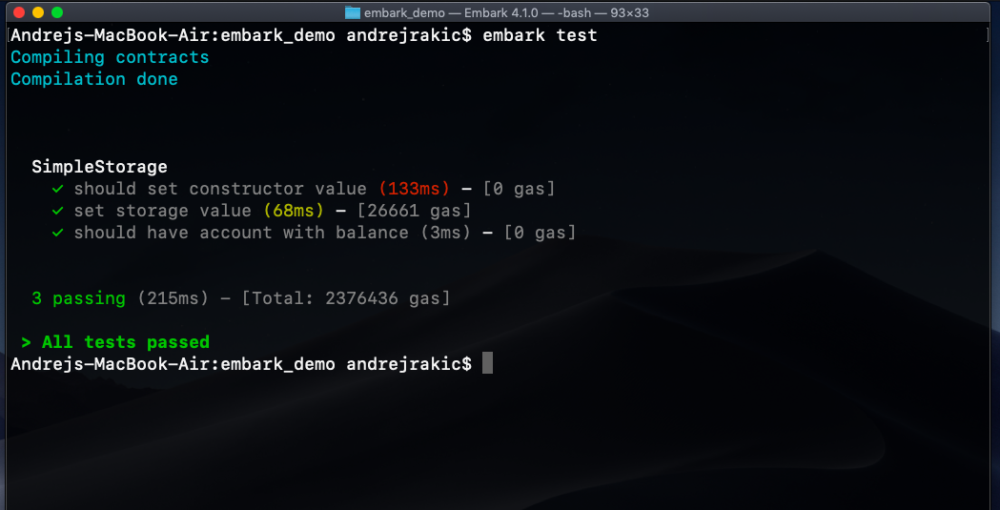

Embark allows you to generate a coverage report for your Solidity Smart Contracts by passing the `--coverage` option on the `embark test` command.

```
embark test --coverage
```

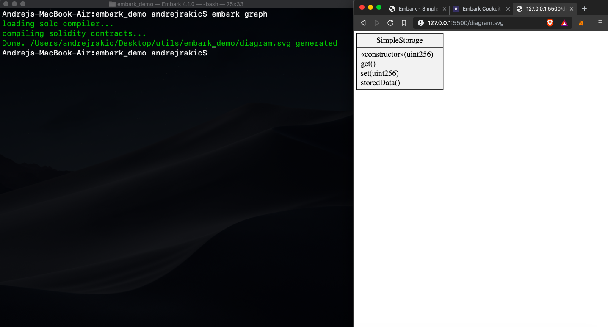

When selecting a file, a more detailed report is produced. Here's what it looks like:


### Graph

Another interesting Embark CLI command is

```
embark graph
```

It generates documentation based on the smart contracts configured.

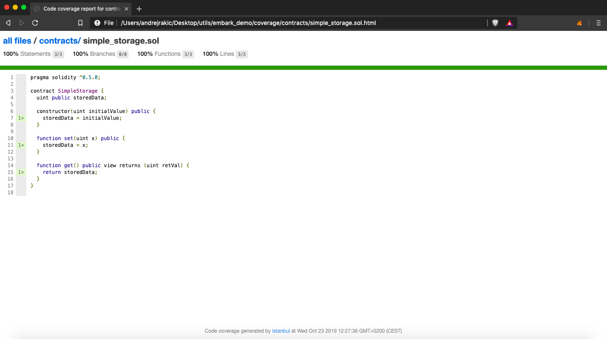

## Conclusion 🚀

Embark is very powerful framework and very [well documented](https://embark.status.im/docs/overview.html).

I'm [Andrej](https://www.linkedin.com/in/andrejrakic/) and if you find this article useful thumbs up 👏🏻
